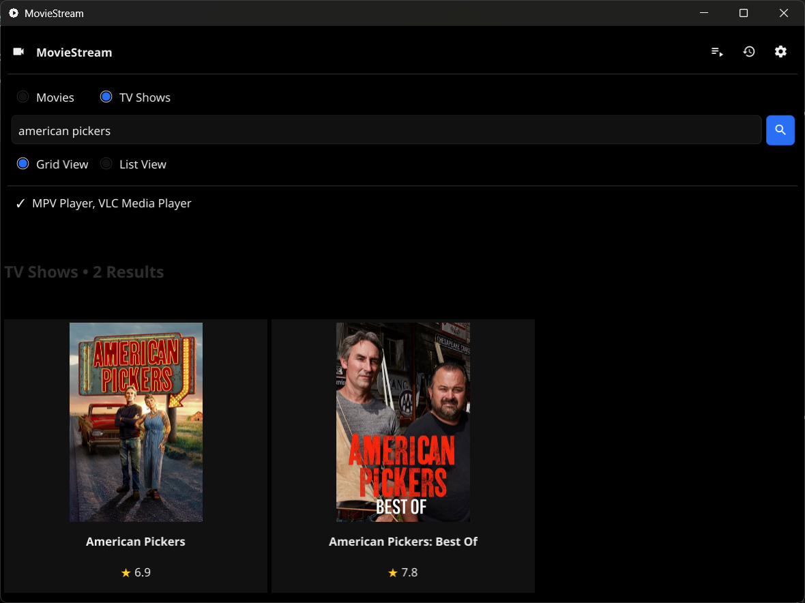
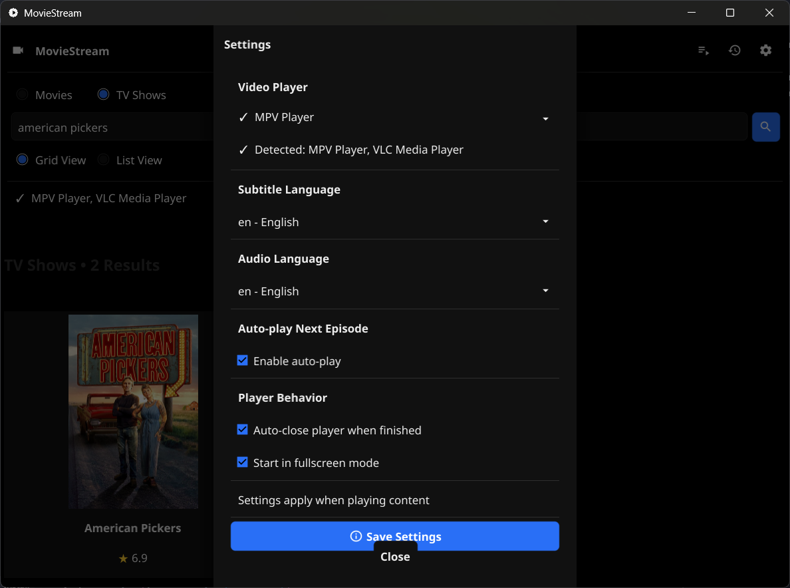
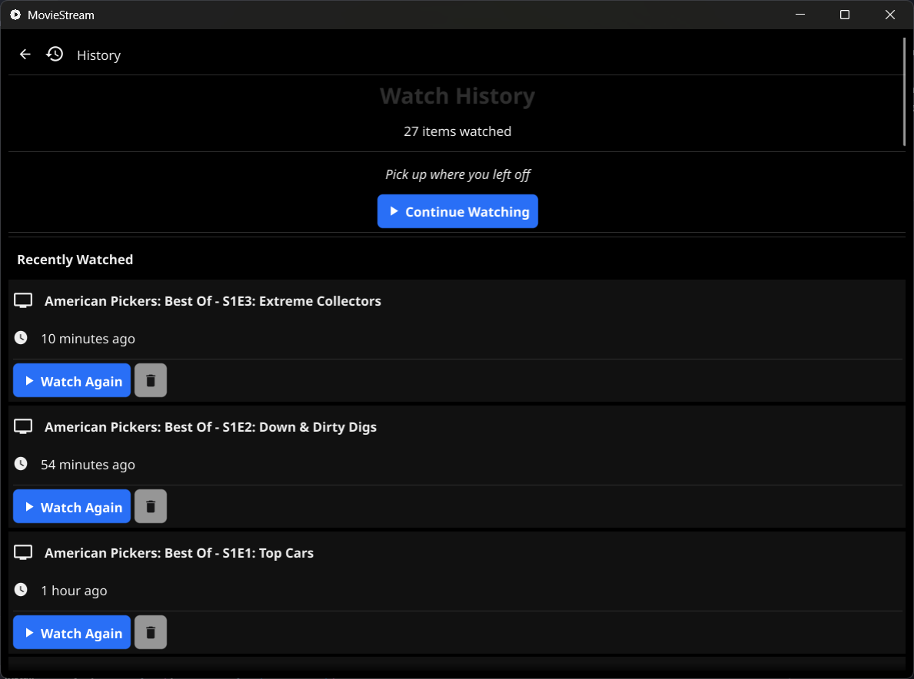
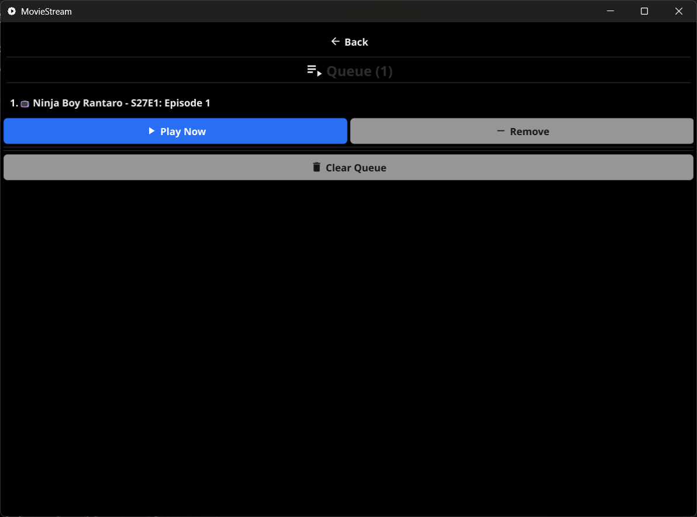

# MovieStream GUI

[](https://github.com/zerdnem/moviestream-desktop/actions/workflows/ci.yml)
[](https://github.com/zerdnem/moviestream-desktop/actions/workflows/release.yml)
[](https://goreportcard.com/report/github.com/zerdnem/moviestream-desktop)
[](LICENSE)

A desktop application for searching and streaming movies and TV shows, built with Go and Fyne.

## Screenshots

<div align="center">
  
  
  
  
  
</div>

## Features

- 🔍 Search for movies and TV shows using TMDb database
- 📺 Browse TV show seasons and episodes
- ▶️ Watch content directly in MPV player
- ⬇️ Download streams (M3U8 format)
- 🎨 Clean, modern GUI interface
- 🖥️ Cross-platform (Windows, macOS, Linux)

## Prerequisites

### 1. Go Programming Language
- Download and install Go from: https://golang.org/dl/
- Minimum version: Go 1.19 or higher

### 2. MPV Player (Required for watching)
- **Windows**: Download from https://mpv.io/installation/
  - Extract to `C:\mpv\` or install using Scoop: `scoop install mpv`
- **macOS**: Install using Homebrew: `brew install mpv`
- **Linux**: Install using package manager: `sudo apt install mpv`

### 3. C Compiler (Required for Fyne)
- **Windows**: Install MinGW-w64 or TDM-GCC
  - Recommended: Install using MSYS2 or Scoop
- **macOS**: Install Xcode Command Line Tools: `xcode-select --install`
- **Linux**: Install gcc: `sudo apt install gcc libgl1-mesa-dev xorg-dev`

## Installation

1. **Clone or navigate to the project directory**
   ```bash
   cd moviestream-gui
   ```

2. **Install Go dependencies**
   ```bash
   go mod tidy
   ```

3. **Build the application**
   ```bash
   go build -o moviestream.exe
   ```

4. **Run the application**
   ```bash
   ./moviestream.exe
   ```

## Usage

### Searching for Content

1. Launch the application
2. Select content type: "Movies" or "TV Shows"
3. Enter your search query
4. Click "Search" or press Enter

### Watching Movies

1. Search for a movie
2. Click "View Details" on your chosen movie
3. Click "▶ Watch" to play in MPV

### Watching TV Shows

1. Search for a TV show
2. Click "View Episodes"
3. Select a season from the dropdown
4. Click "▶ Watch" on any episode to play in MPV

### Downloading Content

1. Navigate to any movie or episode details
2. Click "⬇ Download"
3. Files are saved to `./downloads/` directory
4. Note: M3U8 files need conversion to MP4 using ffmpeg:
   ```bash
   ffmpeg -i input.m3u8 -c copy output.mp4
   ```

## Project Structure

```
moviestream-gui/
├── main.go              # Application entry point
├── api/
│   ├── tmdb.go         # TMDb API client
│   └── stream.go       # Stream extraction logic
├── gui/
│   ├── app.go          # Main GUI and search interface
│   └── tvdetails.go    # TV show details and episodes
├── player/
│   └── mpv.go          # MPV player integration
├── downloader/
│   └── downloader.go   # Download functionality
├── go.mod              # Go module dependencies
└── README.md           # This file
```

## Technologies Used

- **Go**: Programming language
- **Fyne**: Cross-platform GUI framework
- **TMDb API**: Movie and TV show database
- **MPV**: Media player for streaming
- **Velora API**: Intro/outro skip timing
- **111Movies**: Stream source

## Troubleshooting

### "MPV Player not found"
- Install MPV player from https://mpv.io/
- On Windows, ensure MPV is in your PATH or installed to `C:\mpv\`

### "failed to initialize Fyne"
- Make sure you have a C compiler installed
- On Windows: Install MinGW-w64 or use MSYS2
- On macOS: Run `xcode-select --install`
- On Linux: Install gcc and required libraries

### "Stream extraction failed"
- Some content may not be available on the streaming platform
- Try a different movie or TV show
- Check your internet connection

### Build errors
- Run `go mod tidy` to ensure all dependencies are downloaded
- Make sure you're using Go 1.19 or higher: `go version`

## CI/CD Pipeline

This project uses GitHub Actions for continuous integration and deployment:

### Continuous Integration (CI)
- **Triggers:** Runs on every push and pull request to `master`, `main`, or `develop` branches
- **Jobs:**
  - **Lint:** Code quality checks using golangci-lint
  - **Test:** Run unit tests with race detection and coverage
  - **Build:** Compile binaries for Windows, Linux, and macOS
  - **Security Scan:** Vulnerability scanning with Gosec
- **Artifacts:** Build artifacts are available for 7 days after each build

### Continuous Deployment (CD)
- **Release Workflow:** Automatically triggered when you create a new release
- **Outputs:** Pre-built binaries for all platforms attached to the release

### Building for Distribution

#### Automated Builds (GitHub Actions)

When you push a version tag, it will **automatically**:
1. Create a GitHub release
2. Build binaries for all platforms:
   - Windows (amd64) - `.exe` file
   - Linux (amd64)
   - macOS (amd64 and arm64)
3. Attach all binaries to the release

**Option 1: Using the Release Script (Easiest)**

For Linux/macOS:
```bash
chmod +x create-release.sh
./create-release.sh
```

For Windows (PowerShell):
```powershell
.\create-release.ps1
```

The script will:
- Validate your version format
- Create and push a git tag
- Automatically trigger the release workflow
- Show you where to track progress

**Option 2: Manual Tag Creation**

```bash
# Create and push a version tag
git tag -a v1.0.0 -m "Release v1.0.0"
git push origin v1.0.0
```

That's it! GitHub Actions will automatically:
- Create the release on GitHub
- Build Windows `.exe` and other platform binaries
- Attach them to the release

View the progress at: https://github.com/zerdnem/moviestream-desktop/actions

### Manual Builds

#### Windows
```bash
go build -ldflags="-H windowsgui" -o moviestream.exe
```

#### macOS
```bash
go build -o moviestream
```

#### Linux
```bash
go build -o moviestream
```

## License

This project is for educational purposes only. Please respect copyright laws and content licensing in your region.

## Disclaimer

This application uses third-party APIs and streaming services. The authors are not responsible for the content accessed through this application. Always use legal streaming services and respect intellectual property rights.

